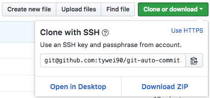

# 感谢大神
!(tywei90)[https://github.com/tywei90/git-auto-commit.git]

# 自动刷github提交记录

**要是觉得这个项目还不错，别忘记star哦**

## 前言
进入自己github主页会看到自己的提交记录，如果某天没有提交记录，那天的小方框就显示灰色。强迫症的我，每次进来看着就感觉不爽，
想着自己每天记得提交点东西，争取像[阮一峰](https://github.com/ruanyf)大神一样，每天都有提交记录。  


但是，毕竟是人，哪天忙了就会忘记提交，所以想着能不能实现在自己阿里云服务器(linux系统)上，设置cron，定制下git命令，实现每天定点自动提交。

## 第一步：克隆我的项目

不同的克隆方式导致校验方式不同，对应的免秘方式也不一样。简单来说，https通过记住账号密码免登，ssh通过校验生成的密钥免登。  
1. https克隆

  

2. ssh克隆



如果，你已经克隆了项目，不知道采用了哪种方式，可以执行：
```bash
git remote -v
```
如果是这样：  
```
origin https://github.com/tywei90/git-auto-commit.git (fetch)  
origin https://github.com/tywei90/git-auto-commit.git (push)  
```
那么就是https方式； 

如果是这样：  
```
origin	git@github.com:tywei90/git-auto-commit.git (fetch)  
origin	git@github.com:tywei90/git-auto-commit.git (push)  
```
那么就是ssh方式。  

更改克隆方式也很简单：  

https ——> ssh  
`git remote set-url origin git@github.com:tywei90/git-auto-commit.git`

ssh ——> https  
`git remote set-url origin https://github.com/tywei90/git-auto-commit.git`

## 第二步：免密登录
针对上面两种克隆项目的方式，有两种免密登录设置。

### 1.账号密码免登（https克隆）
```bash
cd git-auto-commit/.git
vim config
```
在config文件最后添加如下代码：
```
[credential]  
    helper = store
```
保存，输入一次账号密码后第二次就会记住账号密码了

### 2.公钥私钥免登（ssh克隆）

#### 2.1 生成公钥和私钥

检查本机的ssh密钥：
```bash
cd ~/.ssh 
ls
```
如果提示：No such file or directory，说明你是第一次使用git，那就自己手动创建目录  

使用ssh-keygen命令生成ssh密钥，命令如下：
```bash
ssh-keygen -t rsa
```
输入上面命令后，遇到选择直接回车，即可生成ssh 密钥。生成ssh 密钥后，可以到~/.ssh目录下查看相关文件，一般来说ssh 密钥会包含id_rsa和id_rsa.pub两个文件，分别表示生成的私钥和公钥。

#### 2.2 拷贝公钥到你的github
在.ssh目录下，执行`cat id_rsa.pub`，复制所有公钥内容

点击github的头像，在下拉菜单中选择 setting 选项，在打开页面的左侧菜单中点击 SSH and GPG keys，然后点击新页面右上角绿色按钮 New SSH key。填写title值，并将复制的公钥内容粘贴到key输入框中提交。

#### 2.3 测试链接github
我看网上是输入如下命令：
```bash
ssh –t git@github.com
```
然后，我的会报ssh: Could not resolve hostname \342\200\223t: Name or service not known的错误，搜了下，解决办法是执行下列命令：
```bash
ssh -t -p 22 git@github.com 
```
-p表示修改服务器端口为22，当提示输入(yes/no)?时在后面输入yes回车即可。但是最后还是报错，后来又搜了下，执行如下代码：
```bash
ssh git@github.com
```
即将`-t`去掉就好了，看到 Hi ** You've successfully authenticated, but GitHub does not provide shell access. 说明连接成功了，大家可以都试一试。

## 第三步：设置cron，定时自动提交任务
项目里的add.js是用来修改records.txt的，每次执行会将当前的时间附加到records.txt文件末尾。然后让git自动提交即可。下面关键是cron的设置，对于linux系统不熟悉的我还是花了点时间的，这里直接将cron设置粘贴出来。先执行`crontab -e`进入cron编辑，然后粘贴如下代码：
```bash
00 12 * * * cd /home/git-auto-commit && git pull && /root/.nvm/versions/node/v6.6.0/bin/node add.js && git commit -a -m 'git auto commit' && git push origin master && git log -1 | mail -s "git auto commit successfully!" wty2368@163.com
```
* `00 12 * * *`的意思是，每天的12:00执行后面的命令。  

* `/root/.nvm/versions/node/v6.6.0/bin/node`是node二进制执行文件的绝对路径，不能直接写node命令，不会识别的。如何查出自己的node执行目录，其实很简单，执行`which node`即可。

* `'git auto commit'`是每次提交的comment，可以随意发挥

* `git log -1 | mail -s "git auto commit successfully!" wty2368@163.com` 是取最新的一次git提交记录log作为邮件内容，"git auto commit successfully!"作为标题，发送邮件给wty2368@163.com邮箱。当然这个是可选项，我想让每次自动提交结束后给我发一封确认邮件，通过观察邮件内容的date值是不是当前时间，就可以判断这次自动提交是否成功。如果大家要实现这个功能，需要配置下linux邮件发送设置，这个有时间再写。主要要注意阿里云服务器对邮件25端口的限制，比较坑！

## 第四步：利用shell脚本批量补上之前的提交记录
上面的步骤解决了之后每天的git提交记录，但是github自己主页默认显示之前一年的提交记录，那如何补上之前的记录呢？好在github的提交记录时间以commit时间为准，所以我们可以更改自己电脑的时间，然后再commit。我系统是centos7，这里仅以此为例。不同linux版本修改时间的命令可能不同，大家网上百度下，文章很多。

### 4.1 修改系统时间为想要弥补时间段的终点
比如，想要修改时间段位2018-01-01~2018-01-31，那么需要修改系统时间为2018-01-31，脚本如下：
```sh
timedatectl set-time '2018-01-31 13:00:00'
```
### 4.2 进入项目目录，执行loop脚本
确定我们要修改的天数，2018-01-01到2018-01-31一共是31天，我们在命令行传入此参数
```sh
cd git-auto-commit
screen -d -m -L sh loop.sh 31
```
这里，`screen -d -m -L`命令可以将我们执行的任务后台，这样即使退出服务器连接也不会终止脚本的运行。大家可以刷新自己的github主页，看看是不是灰色区域都变绿了。

## 后记
至此，github自动提交设置就完成了。我们来看下成果：


然后每天中午12点会受到邮件如下：


其实，刷github提交记录本身没什么意义，但是我想说的是：工作生活中，我们经常会有各种各样的想法，大家不要忽视了或者觉得很难就不去做。其实真正动手去实践，发现并没有那么难，反而很有趣。而且不知不觉中就学到了很多知识。

(完)
